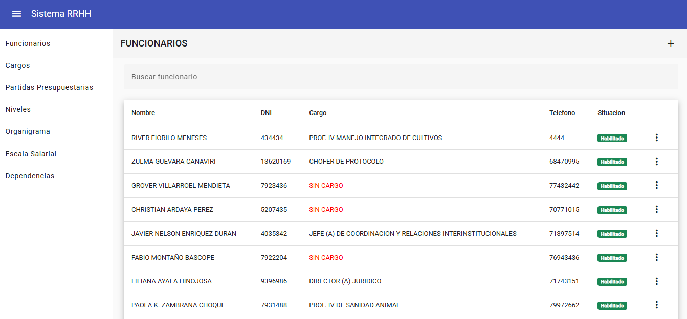
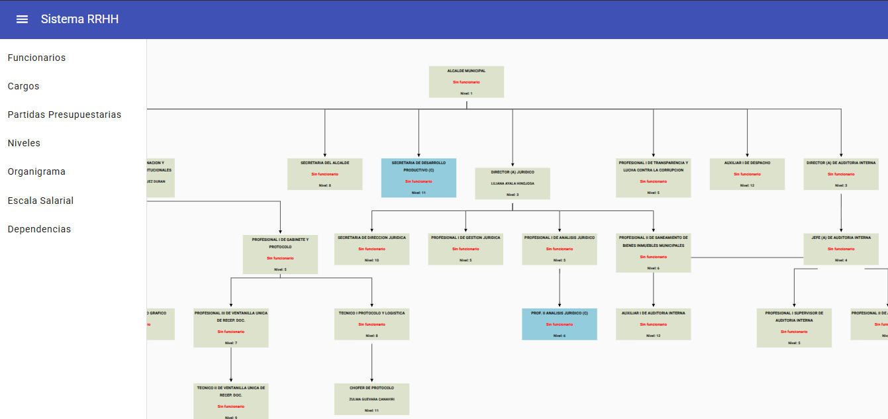
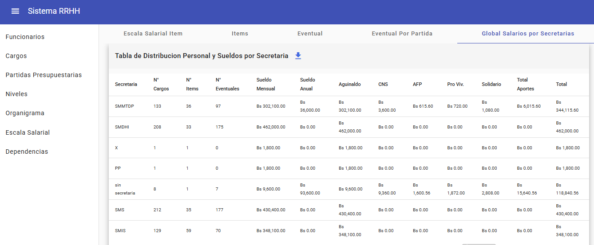

# 🖥️ Frontend - Sistema POA y Organigrama

Este proyecto es el frontend de la aplicación web desarrollada con Angular. Se encarga de la visualización y gestión de diferentes elementos del POA (Plan Operativo Anual), permitiendo interactuar con el backend para crear cargos, dependencias, niveles, y visualizar automáticamente el organigrama institucional.

## 📄 Páginas disponibles

- Funcionarios
- Cargos
- Partidas Presupuestarias
- Niveles
- Organigrama
- Escala Salarial
- Dependencias

## ⚙️ Requisitos

- Tener instalado [Node.js](https://nodejs.org/)
- Tener instalado Angular CLI globalmente:

```bash
npm install -g @angular/cli
```

## ▶️ Instalación y ejecución

1. Clona el repositorio y entra en la carpeta del proyecto.
2. Instala las dependencias:

```bash
npm install
```

3. Ejecuta el servidor de desarrollo:

```bash
ng serve
```

4. Abre tu navegador y navega a:

```
http://localhost:4200/
```

La aplicación se recargará automáticamente si cambias alguno de los archivos fuente.

## 🖼️ Interfaz de usuario

Aquí se visualizan las principales vistas del sistema para la gestión del POA y el organigrama institucional:

### 📋 Tabla de Funcionarios



### 🧩 Organigrama



### 💰 Escala Salarial


